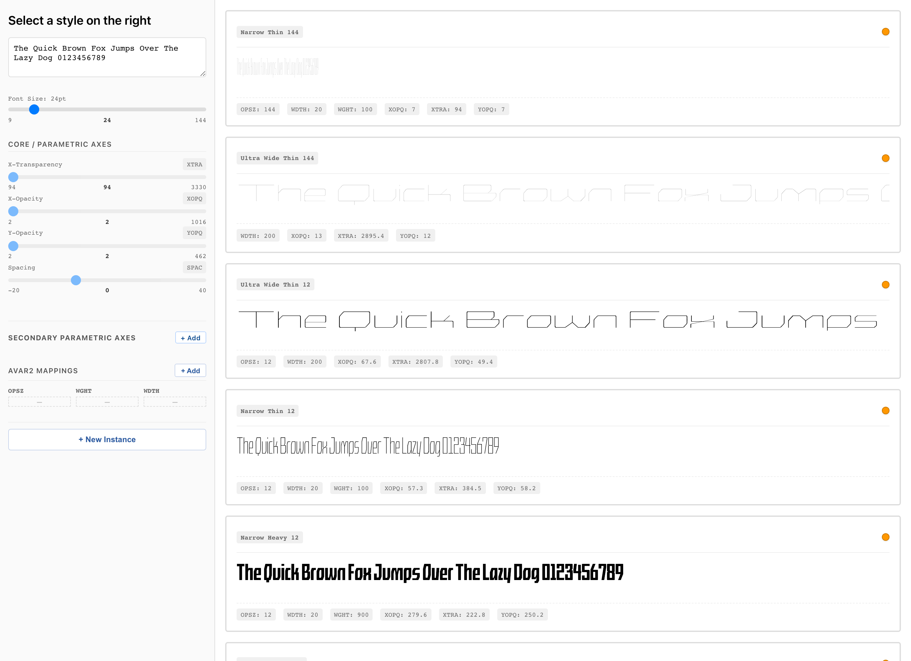
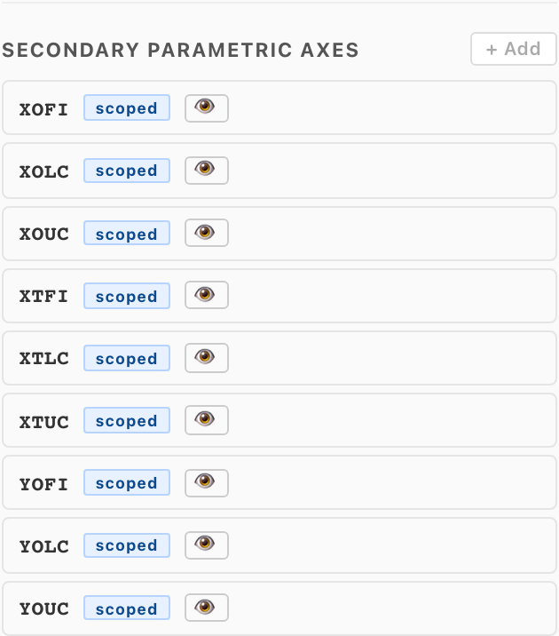
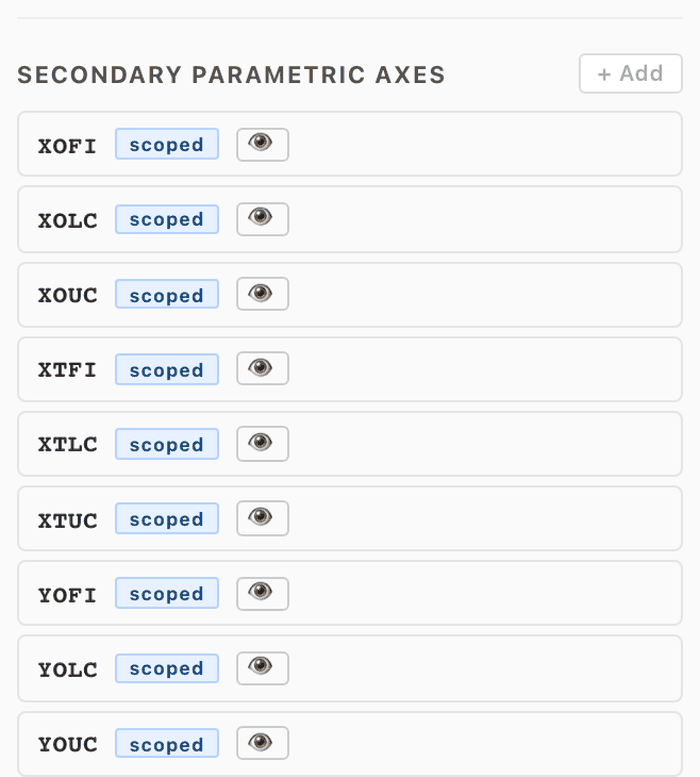
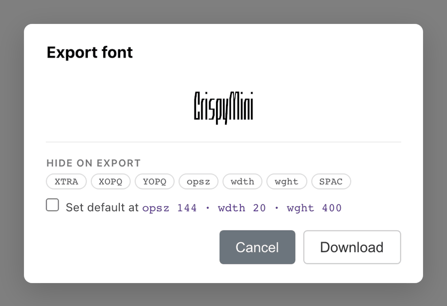
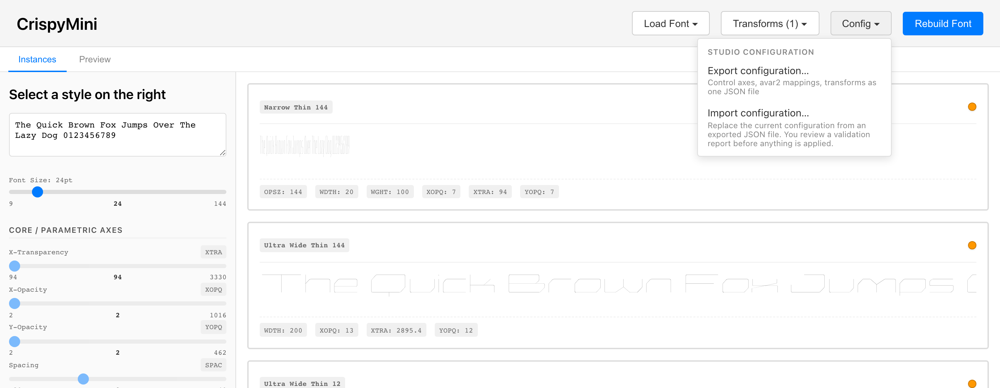

# avar2-studio

Visual authoring and preview tool for avar2 variable fonts.

For type designers working in parametric designspaces (XOPQ / YOPQ /
XTRA, …) who want to expose familiar axes (`wght`, `wdth`, `opsz`, …)
to end users. Parametric axes describe stroke shapes, not styles;
avar2-studio lets you author named instances at parametric coordinates
and builds the avar2 table that makes a user's `wght=400` slider land
on the point you chose.

Point it at a `.glyphs` or `.designspace` file and it opens a
browser-based editor. The preview renders the **actual built font** —
the browser applies the real avar2 table, so what you see is what
ships. You can also declare **secondary parametric axes** that deform
only chosen glyphs, edit their outlines in an embedded
[Fontra](https://github.com/fontra/fontra) editor, and chain optional
**post-build transforms** onto every build.


## Getting started

Pre-release — not yet on PyPI.

```bash
pipx install https://github.com/agyeiagyeiagyei/avar2-studio/releases/latest/download/avar2_studio-0.1.0.dev6-py3-none-any.whl
avar2-studio /path/to/MyFont.glyphs       # or .designspace
```

All dependencies (fontc, gftools, …) come with the wheel. The server
prints a URL (default `http://localhost:5001`); the first build runs
on launch and takes a couple of seconds. The released wheel lags the
repo — install from source ([Development](#development)) for the
newest features.

Launching with no argument opens a **Load Font** picker: upload your
own `.glyphs`, or start from a bundled example —

- **Crispy Mini** — `.glyphs`, unified parametric axes (every glyph varies)
- **Roboto Delta Mini** — `.designspace`, case-split axes (only uppercase varies)

Examples are staged into `~/.avar2-studio/workspace/<example>/`, so
your edits persist across launches and the repo fixtures stay clean.

| flag | default | |
|---|---|---|
| `--port` | `5001` | avoids macOS AirPlay on 5000 |
| `--host` | `127.0.0.1` | |
| `--build-dir` | `.avar2-studio/build/` next to the source | |
| `--csv` | sibling `<basename>-avar.csv` | |
| `--no-fontc` | off | compile with fontmake instead of fontc |
| `--debug` | off | Flask auto-reload (can kill in-flight builds) |

`avar2-studio doctor` checks the environment without needing a source
file.

## Your files

The tool keeps its artifacts in sibling files next to your source:

```
~/work/MyFont/
├── MyFont.glyphs             # your source (written back only when you save edits)
├── MyFont-avar.csv           # avar2 mappings — commit
├── MyFont-control.json       # secondary parametric axes + brace layers — commit
├── MyFont-transforms.json    # enabled transforms + params — commit
└── .avar2-studio/            # tool-managed (config, build output, shadow source) — gitignore
```

Commit the three sidecars alongside the source (`-control.json` and
`-transforms.json` only appear once you use those features). Builds
compile from a shadow copy once studio-authored brace layers exist, so
your original source is never modified by studio axis authoring.

## Features

### Instances & avar2 mappings

The **Instances** tab is the authoring surface: create named instances
(`Regular`, `Bold`, `Thin Extended`, …) and tune each one's parametric
coordinates with the sidebar sliders — each instance renders live as a
row of the built font. Give an instance user-axis coordinates (`wght`,
`wdth`, `opsz`, …) and it becomes an avar2 mapping; a usable
designspace with many user axes can reasonably have a few dozen instances spanning the design grid.



[docs/authoring-instances.md](./docs/authoring-instances.md) walks the
full workflow on both examples, with a heuristic for choosing an axis
layout for your own source.

### Sidebar axis sections

- **CORE / PARAMETRIC AXES** — axes that deform every glyph in the
  font. These are the base designspace surface that user axes map
  into.
- **SECONDARY PARAMETRIC AXES** — axes that deform only some glyphs.
  Two badges: `scoped` (authored on a subset of glyphs — expand the
  row to see which) and `studio` (declared in avar2-studio rather than
  in the source file).



Declare a studio axis with **+ Add**: pick its glyphs, pin brace
layers at any designspace location, and click a layer's ↗ to draw its
outline in the embedded Fontra editor. Rows warn when authored layers
don't reach the axis extremes. Deep-dive:
[docs/secondary-parametric-axes.md](./docs/secondary-parametric-axes.md).



### Preview & export

The **Preview** tab drives the built font the way an end user's app
would: type directly in the specimen to change the text, and move any
fvar axis — user axes, secondary parametric axes, and the underlying
parametric axes (collapsed by default; they follow the user axes
through your mappings).


**Download** opens an export dialog where you can mark axes as hidden
in the exported font and optionally **set a default**: pick an axis
combination, and the export interpolates a master there and makes it
the font's origin — the source file is never touched.



### Post-build transforms

The **Transforms** menu in the header holds optional VF→VF steps that
run after every build; which are enabled (and their params) is saved
to `<basename>-transforms.json`.


Built-ins:

- **Spacing — uniform (gftools)** — `SPAC` axis; every glyph tracks by
  the same amount
- **Spacing — width-aware** — `SPAC` axis; tracking proportional to
  glyph width
- **Clean fvar instances** — regenerate named instances
  (`gftools fix-instances`)
- **Rebuild STAT table** — registered axes only (`gftools gen-stat`)
- **Smooth unhinted rendering** — gasp + prep (`gftools fix-unhinted`)

Spacing transforms move only sidebearings and advances — outlines
never change. Write your own: drop a `.py` subclassing `Transform`
into `~/.avar2-studio/transforms/` and it appears in the menu on the
next launch.

### Configuration export / import

The **Config** menu moves a whole studio configuration between sources
or machines. **Export** downloads a single
`<family>-avar2studio.json` bundle: the secondary parametric axes and
their brace-layer declarations, the avar2 mappings, and the transform
settings (drawn outlines are re-seeded by interpolation on import).
**Import** validates first and is all-or-nothing — a report lists
anything the loaded source is missing, and nothing is applied until
you confirm. Importing replaces the current studio configuration.



## Development

```bash
git clone https://github.com/agyeiagyeiagyei/avar2-studio
cd avar2-studio
python -m venv .venv && source .venv/bin/activate
pip install -e ".[dev]"
cd frontend && npm ci && npm run build && cd ..
```

For frontend hot reload, run `npm start` in `frontend/` alongside the
backend and open `http://localhost:3000`. New to the codebase?
[docs/HANDOVER.md](./docs/HANDOVER.md) covers the architecture,
environment traps, and known issues.

## Roadmap

- [ ] PyPI publish (`pipx install avar2-studio`)
- [ ] v0.1.0 release (current pre-releases are `v0.1.0.devN`)
- [ ] Push-to-source sync (write studio-declared axes from the sidecar
  into the `.glyphs` on request)
- [ ] Grade-master comparison panel (parked on the `grade-comparison`
  branch)

## License

Apache-2.0. See [LICENSE](LICENSE).
