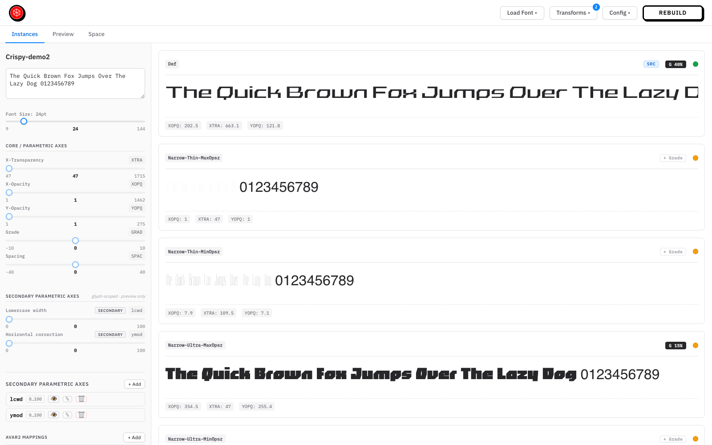
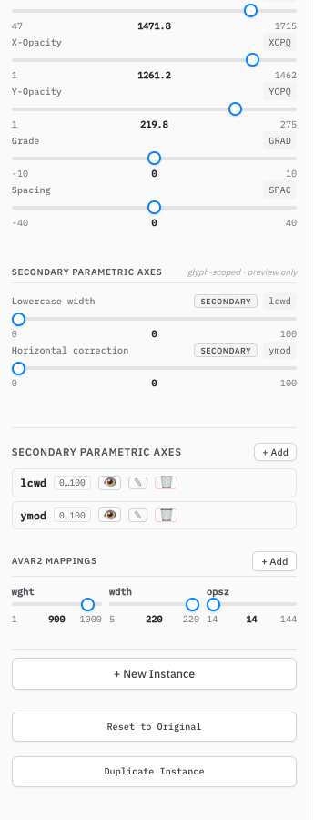
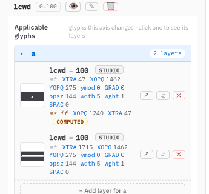
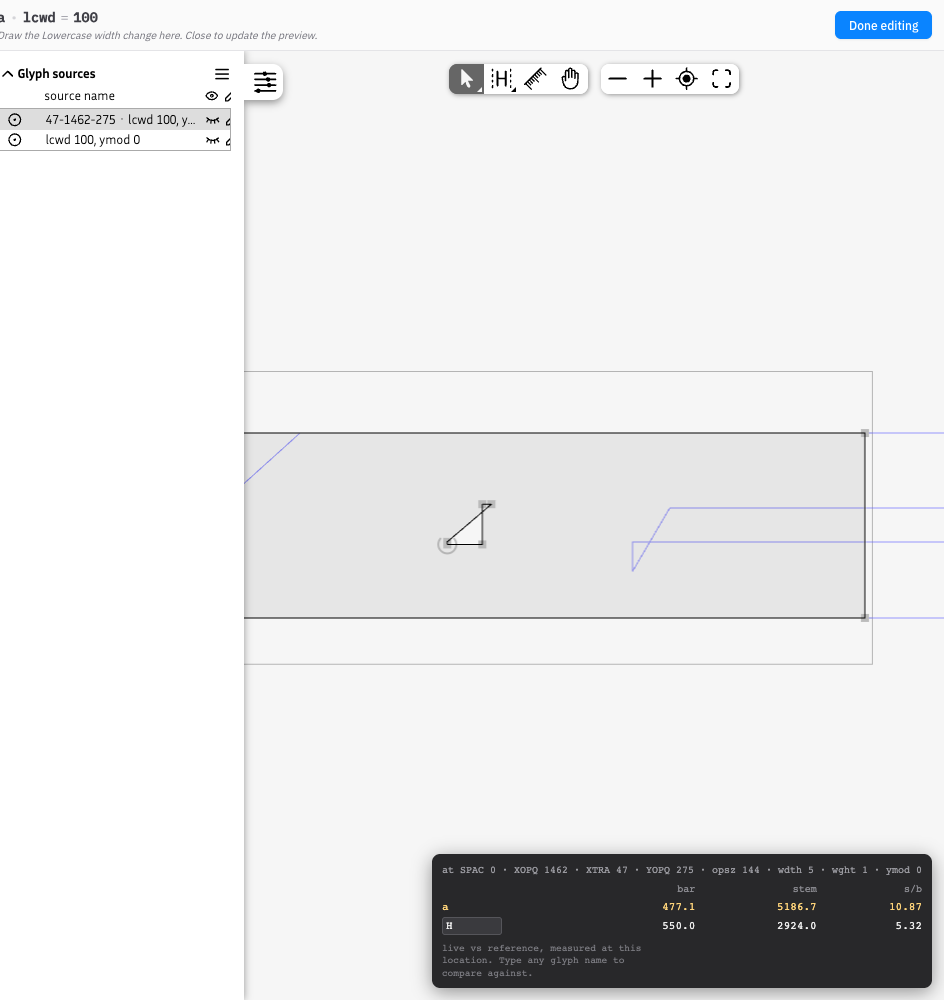
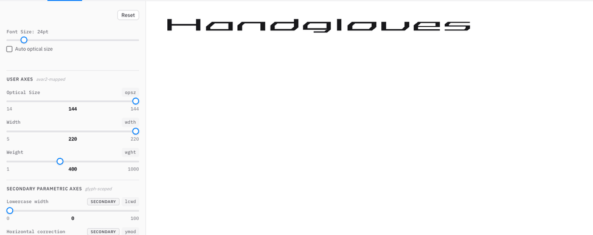
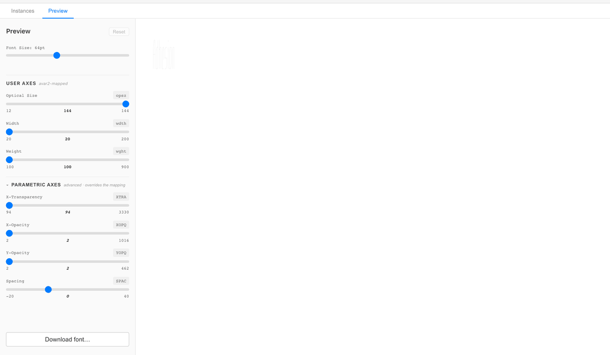
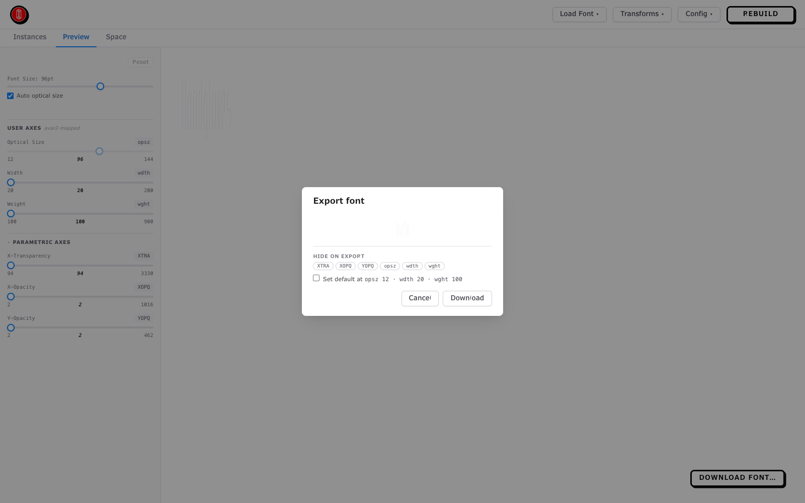
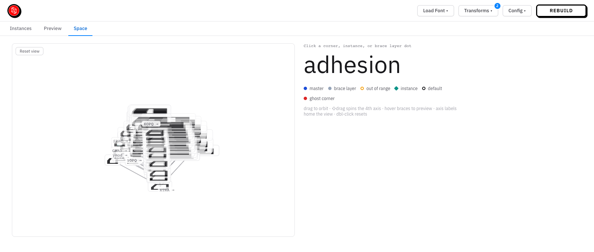
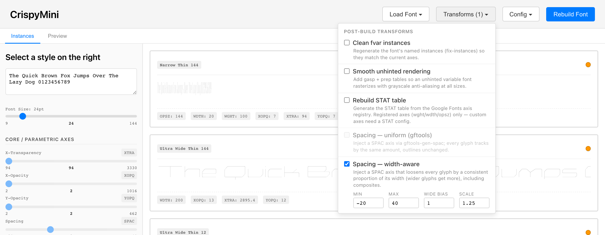

# avar2-studio

Visual authoring and preview tool for avar2 variable fonts.

For type designers working in parametric designspaces (XOPQ / YOPQ /
XTRA, …) who want to expose familiar axes (`wght`, `wdth`, `opsz`, …)
to end users. Author named instances at parametric coordinates;
avar2-studio builds the avar2 table that makes a user's `wght=400`
slider land on the point you chose.

Point it at a `.glyphs` or `.designspace` file and it opens a
browser-based editor on the **actual built font**. You can also
declare **secondary parametric axes** that deform only chosen glyphs
(editable in an embedded [Fontra](https://github.com/fontra/fontra)
editor), and chain optional **post-build transforms** onto every build.



Try it without installing: the [static demo](https://agyeiagyeiagyei.github.io/avar2-studio/)
(example fonts, plus in-browser compile of uploaded `.glyphs` — including
secondary-axis authoring, correction layers, and the fixer transforms).

## Getting started

Pre-release — not yet on PyPI.

```bash
pipx install https://github.com/agyeiagyeiagyei/avar2-studio/releases/latest/download/avar2_studio-0.1.0.dev6-py3-none-any.whl
avar2-studio /path/to/MyFont.glyphs       # or .designspace
```

All dependencies (fontc, gftools, …) come with the wheel. The server
prints a URL (default `http://localhost:5001`); the first build runs
on launch. The released wheel (dev6) predates most current features —
install from source ([Development](#development)) for the newest.
Launching with no argument opens a **Load Font** picker —
upload your own source or start from a bundled example (Crispy Mini,
Roboto Delta Mini). `avar2-studio doctor` checks the environment.
Useful flags: `--port` (default 5001, avoids macOS AirPlay on 5000),
`--no-fontc` (compile with fontmake instead of fontc), `--debug`.

## Your files

Artifacts live next to your source, as committable sidecars:

```
MyFont.glyphs             # your source (written back only when you save edits)
MyFont-avar.csv           # avar2 mappings
MyFont-control.json       # secondary parametric axes + brace layers (once used)
MyFont-transforms.json    # enabled transforms + params (once used)
MyFont-grade.json         # grade settings (once used)
.avar2-studio/            # tool-managed (config, builds, shadow source) — gitignore
```

Studio axis authoring never modifies your original source: builds
compile from a shadow copy once studio-authored brace layers exist —
and the studio watches your original, regenerating the shadow
automatically when you edit it in Glyphs.

## Features

### Instances & avar2 mappings

The **Instances** tab is the authoring surface: create named instances
and tune each one's parametric coordinates with the sidebar sliders —
each row renders live in the built font. Give an instance user-axis
coordinates (`wght`, `wdth`, `opsz`, …) and it becomes an avar2
mapping. [docs/authoring-instances.md](./docs/authoring-instances.md)
walks the full workflow.

- **CORE / PARAMETRIC AXES** — deform every glyph in the font.
- **SECONDARY PARAMETRIC AXES** — deform only chosen glyphs (`scoped`
  and `studio` badges). See the next section.
- **Mapping lint** flags rows the build would silently drop: grid
  points no axis reaches, and rows sitting at the default location
  (discarded, skewing every sibling row) — before they bite.

### Secondary parametric axes

Sometimes the global axes are *almost* right. Crispy's `wght` runs to
1000, and the heavy end gains contrast that sits wrong on the
lowercase — so Crispy declares `lcwd`, an axis that renders each
lowercase glyph there *as if at* a lighter XOPQ, while the capitals
stay put. A secondary parametric axis is a slider that deforms only
the glyphs you give it, built from brace layers pinned anywhere in the
designspace.

- **+ Add** to declare one: name it, pick its glyphs, pin the
  locations. New locations can land on every applicable glyph in one
  submit.
- **Correction layers** compute an outline *as if at* another
  parametric point, re-derived on every build; the studio warns when a
  correction is unpinned and would leak along an axis.
- Draw the outlines in the **embedded Fontra editor** — against a
  reference font, with live measurements in the HUD.
- Everything lands in the `-control.json` sidecar, drawings included.









Deep-dive:
[docs/secondary-parametric-axes.md](./docs/secondary-parametric-axes.md).

### Preview & export

The **Preview** tab drives the built font the way an end user's app
would: type directly in the specimen, move any fvar axis. Moving a
user axis reflects the computed avar2 mapping onto the parametric
sliders.




A note on rendering engines: the exported font's avar2 works wherever
avar2 is implemented — HarfBuzz-based stacks and recent WebKit/CoreText
apply it. Chrome does not apply avar2 in its text pipeline yet, so in
the in-browser preview the glyphs follow the fvar axes while the
sliders show the computed mapping. What ships is the real table either
way.

**Download** opens an export dialog: mark axes as hidden in the
exported font, or **set a default** — pick an axis combination and the
export interpolates a master there and makes it the font's origin (the
source file is never touched).



### Space tab

The **Space** tab shows the designspace as an orbitable Noordzij cube —
N-dimensional, so a fourth master-covered axis renders as a tesseract
you can spin. Masters, brace layers and instances appear as points in
the axis box, corner chips render live specimens at their exact
locations — red when a corner has no source coverage (a ghost), with
one-click pinning that **synthesizes the corner by extrapolation** when
no sweep reaches it (and refuses inline, with the reason, when it
can't). The findings rail in the tab lists the same audit — missing
corners, out-of-range sources, collapses — with the fixes alongside.



### Grade

Darken or lighten a style **without changing its advance widths**.
Turn **Grade** on in the Transforms menu, then click a style's **`G`**
badge to set its %; grades interpolate between the styles you set, so
you grade a few anchors, not every style.
[docs/grade.md](./docs/grade.md).

### Post-build transforms

Optional VF→VF steps that run after every build, saved to
`<basename>-transforms.json`:

- **Spacing — uniform (gftools)** / **Spacing — width-aware** — a
  `SPAC` axis; sidebearings and advances only, outlines never change.
- **Clean fvar instances**, **Rebuild STAT table**, **Smooth unhinted
  rendering** (`gftools`).

Write your own: drop a `.py` subclassing `Transform` into
`~/.avar2-studio/transforms/` and it appears in the menu on the next
launch.



### Configuration export / import

The **Config** menu moves a whole studio configuration between sources
or machines as a single JSON bundle — secondary parametric axes, avar2
mappings, transforms, grade, corner pins. Import validates first and
is all-or-nothing: a report lists anything the loaded source is
missing, and nothing is applied until you confirm.

## Development

```bash
git clone https://github.com/agyeiagyeiagyei/avar2-studio
cd avar2-studio
python -m venv .venv && source .venv/bin/activate
pip install -e ".[dev]"
cd frontend && npm ci && npm run build && cd ..
```

For frontend hot reload, run `npm start` in `frontend/` alongside the
backend and open `http://localhost:3000`. New to the codebase?
[docs/HANDOVER.md](./docs/HANDOVER.md) covers the architecture,
environment traps, and known issues.

## Roadmap

- [ ] PyPI publish (`pipx install avar2-studio`)
- [ ] v0.1.0 release (current pre-releases are `v0.1.0.devN`)
- [ ] Push-to-source sync (write studio-declared axes from the sidecar
  into the `.glyphs` on request)
- [ ] Grade-master comparison panel (parked on the `grade-comparison`
  branch)

## License

Apache-2.0. See [LICENSE](LICENSE).
