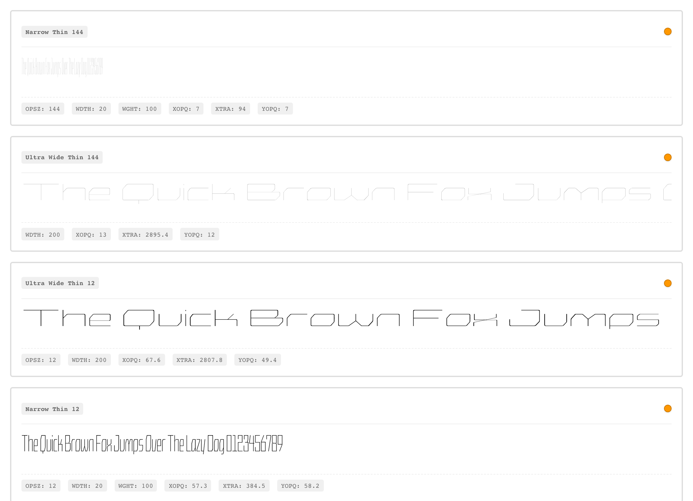
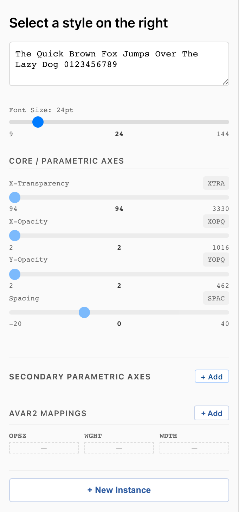
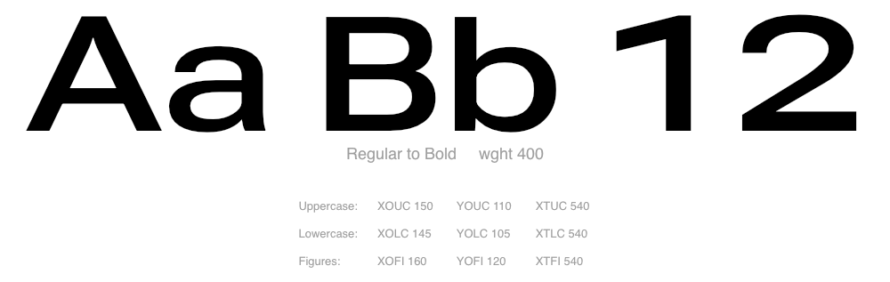

# Authoring instances from parametric axes

avar2-studio works on top of any source file whose designspace is
intended to be parametric. That is, it takes pre-defined masters and treats them as elemental components of conventional axes, such as Weight, Width, etc. 

Instead avar2 Studio is 

This doc walks through the workflow it exists to
support — translating parametric stroke vocabulary into named
stylistic instances — using the two real-world fonts in the studio's
[`examples/`](../examples/) directory as concrete demonstrations.

The two examples are not an exhaustive listing of approaches, but are two established ones, intended to show **two ways designers can lay out
the parametric axes underneath**. The avar2 csv table the studio
produces is identical in shape between them; the difference is in
how many axes each font ships and what each one deforms.

## Design approach — multiple-master heritage vs. duovar / parametric (STUB)

> **Placeholder — to be expanded when we revisit the authoring
> instances walkthrough.** This section will frame both Crispy and
> Roboto Delta as descendants of Adobe's Multiple Master (MM) lineage
> — designs whose axes are deformations of basic letterform attributes
> (stroke weight, optical size, x-height, contrast) rather than
> named styles — and contrast that with the more common "one axis
> per user-facing dimension" (duovar / wght × wdth) approach. The
> point will be that parametric axes are a *substrate* for the
> conventional axes the user sees via avar2, not a competitor to them.
>
> Reference reading parked here:
>
> - Wikipedia, *Multiple master fonts* — https://en.wikipedia.org/wiki/Multiple_master_fonts
> - Adobe community thread, *More information on variable type* —
>   https://community.adobe.com/questions-94/more-information-on-variable-type-1503356
> - Eye on Design, *Parametric and variable typeface systems —
>   shape-shifters for letterforms* —
>   https://eyeondesign.aiga.org/parametric-and-variable-typeface-systems-shape-shifters-for-letterforms/
> - Donald Berry / University of Waterloo lecture notes on Adobe's MM
>   model — https://cs.uwaterloo.ca/~dberry/COURSES/electronic.pub/fishler/multiple.htm
>
> Crispy and Roboto Delta will serve as the two worked examples for
> the unified vs case-split decompositions inside this lineage.

## What both approaches share

Neither approach exposes `wght`/`wdth`/`opsz` as gvar axes (which we would typically use as `Weight`, `Width`, and `Optical Size`). Both fonts
work the same way at the structural level:

1. **The masters describe elemental glyph components through parametric axes** — `XOPQ`
   (thick stroke, e.g. for Latin Fonts), `YOPQ` (thin stroke, e.g. for Latin Fonts), `XTRA` (counter width), and so on. 
2. **The avar2 table translates traditional axes into parametric
   ones.** The user sees and moves familiar
   `wght`/`wdth`/`opsz`/`grad`/`ital` knobs; the avar2 layer
   re-projects those values into the parametric design space at
   render time. The designer's job using avar2 Studio is to author and calibrate the routing.
3. **avar2 studio's CSV is where the routing gets authored.** Each
   row is one named stylistic instance — `Regular`, `Bold Condensed`,
   `Light Display`. Its traditional-axis columns are the user-facing
   address (`wght=400 wdth=100`); its parametric columns are the
   parametric coordinates that address maps to. The CSV format also makes it easy for editing without the UI if desired, or for routing to an AI agent for mass edits.



The split between the two approaches is in **how the parametric
axes themselves are laid out** — how many of them, and which glyphs
each one deforms.

## The unified approach (Crispy)

Crispy ships **three parametric axes** that collectively describe
stroke thickness and counter width for the entire alphabet:

| Axis | What it does | Range |
|---|---|---|
| `XOPQ` | Vertical-stroke thickness (X opacity) | 2 – 1016 |
| `YOPQ` | Horizontal-stroke thickness (Y opacity) | 2 – 462 |
| `XTRA` | Counter width / horizontal proportions (X transparency) | 94 – 3330 |

One `XOPQ` slider thickens every cap stem, every lowercase stem,
every digit stem — uniformly. Same for `YOPQ` on horizontals and
`XTRA` on counters. The masters were drawn so that the same stroke
weight, applied across A and a and 1, produces visually-balanced
results without per-case correction.

This is a *deliberate design constraint*. Crispy's is a mostly straight-line font with gently rounded corners, with the goal being an even
tone across all cases. Authoring a stylistic instance is
correspondingly economical: three parametric values per row in the
CSV is enough to pin down where in design space the style lives.

### Walkthrough: corner → `Regular Condensed`

The fixture opens at its `Default` instance — the first master, the
thin-condensed corner of the parametric space at `XTRA=94`, `XOPQ=2`,
`YOPQ=2`. That's a corner, not necessarily the most usable as a screen-ready style. To produce something
a designer would actually call `Regular Condensed`, the parametric
values need to land elsewhere in the designspace.

| Style | `wght` | `wdth` | `XTRA` | `XOPQ` | `YOPQ` |
|---|---|---|---|---|---|
| Default (corner) | — | — | 94 | 2 | 2 |
| Regular Condensed | 400 | 40 | 456.3 | 228.9 | 164.8 |

{lets include an animation here showing the individual axes, so, this would be four glyphs next to each other, each the same glyph and morphing from min-target, showing the individual axes as the first 3 and the final stylistic axis going from N/A fo finally 400 for Regular, shoing that this isn't just a morphing from 100 to 400 Wieght}

The `wght`/`wdth` columns are what end users see — a familiar
`wght=400 wdth=40` pair. The parametric columns are where in
parametric space the studio actually drives the font. The avar2
mapping bridges them: once this row lands in the CSV, the build
pipeline writes a table so `wght=400 wdth=40` resolves to
`(XTRA=456.3, XOPQ=228.9, YOPQ=164.8)` at render time. By default, the end user
never sees the parametric axes, though they can be enabled as "hidden" axes.

{next let's show two glyphs, both the same one being moved from regular weight (as desribed with the coordinates below, to a bold weight, using these coordinates

XOPQ = }

What the parametric move does, axis by axis:

- `XTRA` 94 → 456.3 — counters open up, letters stop touching each other.
- `XOPQ` 2 → 228.9 — vertical strokes thicken to "regular" weight.
- `YOPQ` 2 → 164.8 — horizontal strokes follow, slightly thinner than vertical for contrast.



## The case-split approach (Roboto Delta)

Roboto Delta ships **nine parametric axes** — the same three concepts
(thick stroke, thin stroke, counter width), but applied independently
per script case:

| | Thick stroke | Thin stroke | Counter width |
|---|---|---|---|
| **Uppercase** | `XOUC` | `YOUC` | `XTUC` |
| **Lowercase** | `XOLC` | `YOLC` | `XTLC` |
| **Figures (digits)** | `XOFI` | `YOFI` | `XTFI` |

The conceptual vocabulary is unchanged — every cell is still some
flavor of "X opacity," "Y opacity," or "X transparency" — but each
script case has its own trio. Moving `XOUC` thickens caps without
affecting lowercase; moving `XOFI` thickens digit strokes without
affecting either. The design admits that the stroke weight that
makes a Bold A read clean at 14 pt closes up the counter on a
Bold e at 14 pt, so it lets the designer push them at different
rates. The same logic explains the figures family: digits sit on
the cap-height baseline but their stroke ceiling is different
again — Roboto Delta gives the designer the room to honor that.

Cost: nine parametric values per stylistic instance instead of three.
That's more authoring per row but it buys per-case control. The full
production Roboto Delta source actually goes further — it adds
case-scoped *height* and *internal-counter* axes (`YTUC`, `YTLC`,
`STUI`, `STLO`, etc.) that we left out of the
[`roboto-delta-mini`](../examples/roboto-delta-mini/) fixture to keep
the demo focused on stroke contrast. The pattern is the same: one
parametric concept, applied per-case for finer-grained control.

### Walkthrough: `Regular` → `Bold`

The animation below morphs from a balanced *Regular* state to a
heavier *Bold* state. Every glyph in `Aa Bb 12` responds because each
script case has its own parametric trio doing the work — caps
thicken through `XOUC`/`YOUC`, lowercase through `XOLC`/`YOLC`,
digits through `XOFI`/`YOFI`. Counter widths (`XTUC`/`XTLC`/`XTFI`)
all open up a touch to keep the heavier shapes readable.



Two named stylistic instances, one per axis, and the same parametric
families in play:

| Style | `wght` | `XOUC` | `YOUC` | `XTUC` | `XOLC` | `YOLC` | `XTLC` | `XOFI` | `YOFI` | `XTFI` |
|---|---|---|---|---|---|---|---|---|---|---|
| Regular | 400 | 150 | 110 | 540 | 145 | 105 | 540 | 160 | 120 | 540 |
| Bold | 700 | 270 | 200 | 620 | 260 | 190 | 610 | 265 | 195 | 600 |

Read across either row and you can see the three-by-three structure:
each family has its own thick/thin/counter triple, and Bold pushes
all three thick-stroke values up while pulling the thin-stroke values
up proportionally less so the contrast holds.

The studio CSV stores one row per instance — so this comparison
table is, almost literally, two rows of `RobotoDeltaMini-avar.csv`
once both instances exist. Add the parametric columns yourself by
creating each instance with the **+ New instance** button (the modal
asks for axis values up front) and the CSV ends up with this exact
shape.

## Choosing between them

The two approaches solve the same problem at different points on a
tradeoff curve:

| | Unified (Crispy) | Case-split (Roboto Delta) |
|---|---|---|
| Parametric axes | 3 | 9 (or more, with case-scoped heights/internal counters) |
| Per-instance authoring | 3 values | 9 values |
| Per-case independence | None — caps and lowercase share stroke weight | Full — each script case is tuned separately |
| Best fit | Display / geometric designs with even tone | Text / system fonts that must read across a wide optical-size range |
| What enables it | Letterforms drawn to share a stroke vocabulary across cases | Letterforms designed with case-distinct optical compensation in mind |

A useful heuristic: **the case-split approach is needed when the
font has to work small.** At display sizes the eye forgives shared
stroke weight; at 8–10 pt it doesn't — caps lock up, counter shapes
in lowercase fill in, digits become hard to count. Roboto Delta's
brief was an 8 pt UI font through display sizes, so it had to ship
the per-case knobs. Crispy's brief was a much narrower size range
with even tone built into the drawing, so it didn't.

If you're picking the approach for your own source: read the font's
brief, then count cases where you'd want a Bold a slightly thinner
than a Bold A (or vice versa). One or two — try unified first; the
authoring is cheap to revisit. More than a handful — start
case-split.

## What "a couple of instances" actually buys you

Two points define a line, not a designspace. The Crispy production
font has 29 authored instances spanning four widths and seven
weights; Roboto Delta has dozens more across multiple optical sizes
and grades. Each one is a point in n-dimensional parametric space.
avar2's job is to interpolate between those points along the
user-facing `wght`/`wdth`/`opsz` axes.

Two rows in the CSV gets you a workable single-axis range — `wght`
between 400 and 700 in the Roboto Delta walkthrough above, or the
corner-to-Regular-Condensed slice in the Crispy walkthrough. Adding
`Thin` (wght 100) extends it left; adding `Black` (wght 900) extends
it right. A `Regular Condensed` would extend the avar2 mapping into
`wdth` territory. Adding optical sizes that prefer thicker
thin-strokes at 9 pt would put `opsz` in play. Each new row is a
few minutes in the studio; the full grid is a few dozen intentional
points.

## Hands-on

Try each approach against its example fixture:

```bash
avar2-studio examples/crispy-mini/sources/CrispyMini.glyphs
avar2-studio examples/roboto-delta-mini/sources/RobotoDeltaMini.designspace
```

Each fixture's README documents the axis table, glyph coverage, and
how the subset was assembled from upstream:

- [crispy-mini/README.md](../examples/crispy-mini/README.md)
- [roboto-delta-mini/README.md](../examples/roboto-delta-mini/README.md)

## How to regenerate the animations

```bash
# Each script lives next to the GIF it produces.
python3 examples/crispy-mini/docs/animate_regular_condensed.py
python3 examples/roboto-delta-mini/docs/animate_regular_to_bold.py
```

Both scripts have `START`/`END` dicts at the top — edit those to
retarget the morph (e.g. `Light → Black`, `Regular → Bold Italic`)
when you want to document other style pairs as your designspace
fills in.
